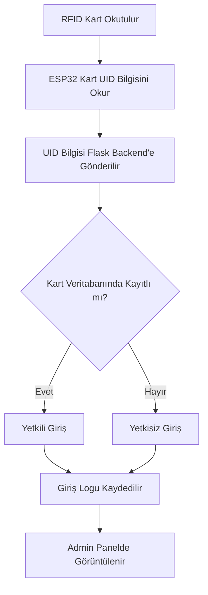

<div align="center">


</div>

<div align="center">


</div>

---

# SecureRoom IoT – RFID Tabanlı Akıllı Giriş ve Personel Takip Sistemi

**SecureRoom IoT**, RFID kart okuma teknolojisi, ESP32 tabanlı IoT cihaz haberleşmesi ve Flask backend altyapısı kullanılarak geliştirilen akıllı bir giriş kontrol ve personel takip sistemidir.

Bu proje; RFID kart okutulduğunda kartın yetkili olup olmadığını kontrol eder, giriş denemelerini kayıt altına alır ve web tabanlı admin panel üzerinden kart yönetimi ile giriş loglarının takip edilmesini sağlar.

Proje, temel bir RFID okuma uygulamasından daha fazlasını hedefler. Donanım, backend, veritabanı ve web arayüzünü bir araya getirerek gerçek dünyada kullanılabilecek bir IoT güvenlik sistemi mimarisi oluşturur.

---

## Projenin Amacı

Bu projenin amacı, RFID kartlar ile giriş kontrolü sağlayan, yetkili ve yetkisiz girişleri ayırt edebilen, giriş kayıtlarını saklayan ve bu kayıtları web arayüzü üzerinden takip edilebilir hale getiren bir sistem geliştirmektir.

Sistem; oda giriş kontrolü, personel devam takibi, laboratuvar erişim kontrolü, küçük işletme güvenliği veya IoT tabanlı güvenlik sistemleri için temel bir örnek mimari sunar.

---

## Temel Özellikler

- RFID kart okuma sistemi
- ESP32 ile IoT cihaz haberleşmesi
- Flask tabanlı backend API
- Web tabanlı tanıtım sayfası
- Admin panel üzerinden kart yönetimi
- Kart ekleme ve kart silme işlemleri
- Yetkili / yetkisiz giriş kontrolü
- Giriş loglarının veritabanında tutulması
- Admin panel üzerinden giriş loglarını görüntüleme
- SQLite veritabanı kullanımı
- Geliştirilebilir güvenlik sistemi mimarisi

---

## Kullanılan Teknolojiler

### Donanım

- ESP32 / ESP32-CAM
- MFRC522 RFID kart okuyucu
- RFID kart / anahtarlık
- Breadboard
- Jumper kablolar
- LED / Flash LED
- Güç bağlantı elemanları

### Yazılım

- Python
- Flask
- SQLite
- HTML
- CSS
- JavaScript
- Arduino IDE
- REST API mantığı

---

## Proje Klasör Yapısı

Projenin temel klasör yapısı aşağıdaki gibidir:

```text
rfid-personel-takip-sistemi/
│
├── backend/
│   ├── app.py
│   ├── requirements.txt
│   └── secureroom.db
│
├── frontend/
│   ├── templates/
│   └── static/
│
├── ino/
│   └── esp32_rfid_code.ino
│
├── index.html
└── README.md
```

### Klasörlerin Görevleri

| Klasör / Dosya | Açıklama |
|---|---|
| `backend/` | Flask backend dosyalarının bulunduğu klasördür. |
| `app.py` | API endpointlerinin, veritabanı işlemlerinin ve web yönlendirmelerinin bulunduğu ana backend dosyasıdır. |
| `requirements.txt` | Proje için gerekli Python paketlerini içerir. |
| `secureroom.db` | Kart bilgileri ve giriş loglarının tutulduğu SQLite veritabanıdır. |
| `frontend/` | Admin panel ve statik web dosyalarının tutulduğu klasördür. |
| `ino/` | ESP32 / Arduino kodlarının bulunduğu klasördür. |
| `index.html` | Proje tanıtım ve geliştirici bilgileri sayfasıdır. |
| `README.md` | Proje dokümantasyon dosyasıdır. |

---

## Sistem Mimarisi

Sistem üç ana bölümden oluşur:

### 1. IoT Cihaz Katmanı

RFID okuyucu, ESP32 kartına bağlıdır. Kart okutulduğunda RFID UID bilgisi ESP32 tarafından okunur. ESP32, bu UID bilgisini Wi-Fi üzerinden Flask backend sistemine gönderir.

### 2. Backend Katmanı

Backend tarafı Python Flask ile geliştirilmiştir. ESP32’den gelen kart UID bilgisi backend tarafından alınır, veritabanındaki kayıtlı kartlarla karşılaştırılır ve kartın yetkili olup olmadığı belirlenir.

Aynı zamanda tüm giriş denemeleri veritabanına log olarak kaydedilir.

### 3. Web Arayüz Katmanı

Web tarafında iki farklı kullanım vardır:

- `index.html`: Proje tanıtım ve geliştirici hakkında bilgi sayfası
- Admin panel: Kart ekleme, kart silme ve giriş loglarını görüntüleme işlemlerinin yapıldığı yönetim ekranı

---

## Sistem Çalışma Mantığı



---

## Kurulum

Projeyi çalıştırmak için bilgisayarda Python kurulu olmalıdır. ESP32 tarafında ise Arduino IDE kullanılabilir.

---

### 1. Projeyi Bilgisayara İndir

```bash
git clone https://github.com/IMabes/rfid-personel-takip-sistemi.git
cd rfid-personel-takip-sistemi
```

---

### 2. Backend Klasörüne Gir

```bash
cd backend
```

---

### 3. Gerekli Python Paketlerini Kur

```bash
pip install -r requirements.txt
```

Eğer `requirements.txt` dosyası kullanılmıyorsa temel olarak aşağıdaki paketler kurulabilir:

```bash
pip install flask flask-cors
```

---

### 4. Flask Backend Sunucusunu Başlat

```bash
python app.py
```

Sunucu çalıştığında terminalde benzer bir çıktı görülür:

```text
Running on http://127.0.0.1:5000
Running on http://192.168.x.x:5000
```

Buradaki `127.0.0.1` sadece bilgisayarın kendi içinde erişim sağlar.

ESP32’nin backend’e veri gönderebilmesi için bilgisayarın yerel IPv4 adresi kullanılmalıdır.

Örnek:

```text
http://192.168.1.104:5000
```

---

## Web Arayüzüne Giriş

Backend çalıştıktan sonra ana sayfaya tarayıcıdan şu adres ile girilebilir:

```text
http://127.0.0.1:5000/
```

Aynı ağdaki başka bir cihazdan giriş yapılacaksa bilgisayarın IPv4 adresi kullanılmalıdır:

```text
http://192.168.1.104:5000/
```

> `192.168.1.104` örnek IP adresidir. Kendi bilgisayarınızın IPv4 adresiyle değiştirilmelidir.

---

## Admin Paneline Giriş

Kart ekleme, kart silme ve giriş loglarını görüntüleme işlemleri admin panel üzerinden yapılır.

Admin panel adresi:

```text
http://127.0.0.1:5000/admin
```

Aynı ağdaki başka bir cihazdan admin paneline erişmek için:

```text
http://192.168.1.104:5000/admin
```

Admin panel üzerinden yapılabilecek işlemler:

- Sisteme kayıtlı RFID kartları görüntüleme
- Yeni kart ekleme
- Kayıtlı kart silme
- Giriş loglarını görüntüleme
- Yetkili ve yetkisiz giriş denemelerini takip etme

---

## ESP32 / Arduino Ayarları

ESP32’nin backend ile haberleşebilmesi için Arduino kodunda bazı alanların değiştirilmesi gerekir.

---

### 1. Wi-Fi Bilgilerini Güncelleme

Arduino kodundaki Wi-Fi bilgileri kendi ağınıza göre değiştirilmelidir:

```cpp
const char* ssid = "WIFI_ADINIZ";
const char* password = "WIFI_SIFRENIZ";
```

Örnek:

```cpp
const char* ssid = "Ev_Internet";
const char* password = "12345678";
```

> Gerçek Wi-Fi şifrenizi GitHub’a yüklemeyin.

---

### 2. Backend API Adresini Güncelleme

ESP32’nin Flask backend’e istek gönderebilmesi için Arduino kodunda backend API adresi doğru yazılmalıdır.

Örnek:

```cpp
const char* serverUrl = "http://192.168.1.104:5000/check_card";
```

Buradaki IP adresi, Flask backend’in çalıştığı bilgisayarın IPv4 adresi olmalıdır.

Windows’ta IPv4 adresini öğrenmek için terminale şu komut yazılabilir:

```bash
ipconfig
```

Çıktıda `IPv4 Address` kısmındaki adres kullanılmalıdır.

---

### 3. API Key / Güvenlik Anahtarı

Projede ESP32’den gelen isteklerin daha güvenli olması için API key mantığı kullanılabilir.

Eğer Arduino kodunda API key tanımlandıysa:

```cpp
const char* apiKey = "secure-room-secret-key";
```

Backend tarafında da aynı anahtar bulunmalıdır:

```python
API_KEY = "secure-room-secret-key"
```

Bu sayede backend yalnızca doğru anahtarı gönderen ESP32 cihazından gelen istekleri kabul edebilir.

> Eğer projede API key kontrolü henüz aktif değilse bu kısım opsiyoneldir. Ancak gerçek kullanım senaryolarında API key veya token doğrulaması önerilir.

---

## Veritabanı

Projede SQLite veritabanı kullanılmaktadır.

Veritabanı dosyası:

```text
backend/secureroom.db
```

Bu veritabanında temel olarak şu bilgiler tutulur:

- Kayıtlı RFID kartlar
- Kart UID bilgileri
- Yetkili / yetkisiz giriş kayıtları
- Giriş tarih ve saat bilgileri

---

## API Yapısı

Backend tarafında Flask ile REST API mantığı kullanılmıştır.

Örnek endpointler:

| Endpoint | Görev |
|---|---|
| `/` | Ana tanıtım sayfasını açar. |
| `/admin` | Admin panel sayfasını açar. |
| `/check_card` | ESP32’den gelen RFID kart bilgisini kontrol eder. |
| `/cards` | Kayıtlı kartları listeler. |
| `/add_card` | Yeni kart ekler. |
| `/delete_card` | Kayıtlı kartı siler. |
| `/logs` | Giriş loglarını listeler. |

> Endpoint isimleri proje kodundaki son yapıya göre değişebilir. Güncel endpointler için `backend/app.py` dosyası kontrol edilmelidir.

---

## Kullanım Akışı

Sistemin temel kullanım akışı şu şekildedir:

1. Flask backend çalıştırılır.
2. Tarayıcıdan admin panel açılır.
3. ESP32 çalıştırılır ve Wi-Fi ağına bağlanır.
4. RFID kart okuyucu hazır hale gelir.
5. Kullanıcı RFID kartını okuyucuya yaklaştırır.
6. ESP32 kartın UID bilgisini okur.
7. UID bilgisi Flask backend’e gönderilir.
8. Backend kartın kayıtlı olup olmadığını kontrol eder.
9. Kart kayıtlıysa yetkili giriş olarak işlenir.
10. Kart kayıtlı değilse yetkisiz giriş olarak loglanır.
11. Tüm giriş denemeleri admin panelde görüntülenir.

---

## Dikkat Edilmesi Gerekenler

- ESP32 ve backend’in çalıştığı bilgisayar aynı Wi-Fi ağına bağlı olmalıdır.
- Bilgisayarın IPv4 adresi değişirse Arduino kodundaki `serverUrl` adresi de güncellenmelidir.
- Daha stabil kullanım için bilgisayara modem üzerinden sabit IP atanması önerilir.
- Flask backend çalışmıyorsa ESP32 kartı okusa bile sisteme veri gönderemez.
- Gerçek Wi-Fi şifresi, API key, Telegram bot token gibi gizli bilgiler GitHub’a yüklenmemelidir.
- Veritabanında gerçek kullanıcı bilgileri varsa `secureroom.db` dosyası herkese açık repoya eklenmemelidir.

---

## Gizli Bilgiler ve Güvenlik

GitHub’a yüklenmemesi gereken bilgiler:

- Wi-Fi adı ve şifresi
- API key
- Telegram bot token
- Gerçek kullanıcı bilgileri
- Gerçek giriş logları
- Gerçek personel verileri

Bu tarz bilgiler için ilerleyen aşamalarda `.env` dosyası kullanılabilir.

Örnek `.env` yapısı:

```env
WIFI_SSID=wifi_adi
WIFI_PASSWORD=wifi_sifresi
API_KEY=secure-room-secret-key
TELEGRAM_BOT_TOKEN=telegram_token
TELEGRAM_CHAT_ID=telegram_chat_id
```

Örnek `.gitignore`:

```gitignore
.env
__pycache__/
*.pyc
*.db
```

> Not: `*.db` eklenirse SQLite veritabanı GitHub’a yüklenmez. Demo veritabanı paylaşılacaksa bu satır dikkatli kullanılmalıdır.

---

## Gelecek Geliştirmeler

Projeye ilerleyen aşamalarda şu özelliklerin eklenmesi planlanmaktadır:

- Telegram bildirim sistemi
- Yetkisiz girişlerde anlık uyarı gönderimi
- ESP32-CAM ile giriş anında fotoğraf çekme
- Kullanıcı kayıtlarında fotoğraf saklama
- Giriş anında çekilen fotoğraf ile kayıtlı kullanıcı fotoğrafını karşılaştırma
- Kapı açık / kapalı durum sensörü
- Dashboard geliştirmeleri
- AI destekli risk analizi
- WebSocket ile anlık veri güncelleme
- Admin panel için kullanıcı adı / şifre girişi
- Güvenlik sertleştirme çalışmaları

---

## Kullanım Alanları

Bu proje aşağıdaki alanlarda geliştirilebilir ve uyarlanabilir:

- Personel giriş-çıkış takip sistemi
- Akıllı oda giriş sistemi
- Laboratuvar erişim kontrolü
- Küçük işletme güvenlik sistemi
- Okul / ofis giriş kontrol sistemi
- IoT tabanlı güvenlik projeleri
- RFID tabanlı devam takip sistemleri

---

## Öğrenme Kazanımları

Bu proje geliştirilirken aşağıdaki konularda pratik deneyim kazanılmıştır:

- ESP32 kullanımı
- RFID kart okuma mantığı
- IoT cihaz haberleşmesi
- Flask API geliştirme
- SQLite veritabanı kullanımı
- Web tabanlı admin panel tasarımı
- Donanım ve yazılım entegrasyonu
- Giriş loglama sistemi
- API endpoint mantığı
- Temel güvenlik sistemi mimarisi
- Gerçek dünya problemine yönelik proje geliştirme

---

## Geliştirici

<div align="center">

### İrem Kılıçer

Yazılım, IoT, yapay zekâ ve güvenlik sistemleri üzerine projeler geliştirmeye odaklanan geliştirici adayı.

Bu proje; donanım, yazılım, web arayüzü ve güvenlik mantığını bir araya getiren uçtan uca bir IoT uygulaması olarak geliştirilmiştir.

</div>

---

## Lisans

Bu proje eğitim, öğrenme ve geliştirme amacıyla hazırlanmıştır.

İlerleyen aşamalarda açık kaynak lisansı eklenebilir.

---

<div align="center">


</div>
